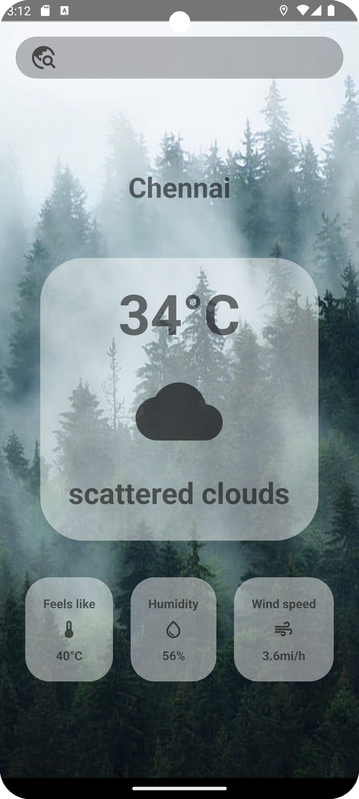
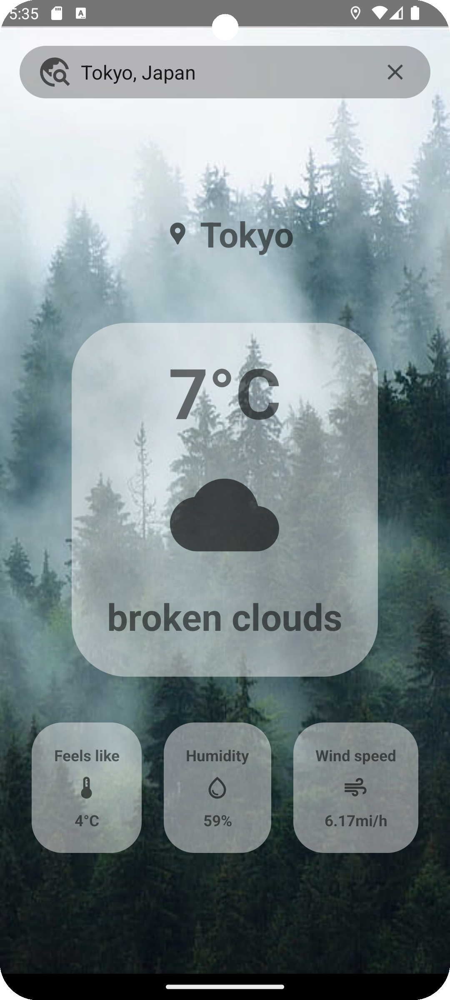
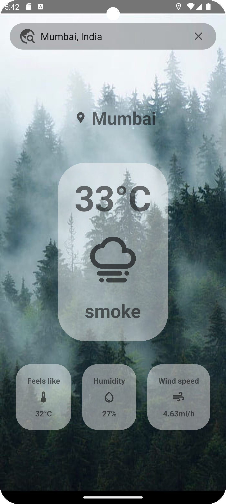

# Android Weather App
This app provides users with real-time weather updates for their current location and allows them to search for weather information in any city worldwide. Powered by the  [OpenWeatherMap](https://openweathermap.org/) API, the app fetches weather data asynchronously using the android-async-http library.

## Features
1. **Current Location Weather**: Upon launching the app, users receive immediate weather updates for their current location.
2. **City Search**: Users can search for weather information for any city by simply entering the city name in the search view.
3. **Asynchronous Data Retrieval**: Leveraging the `android-async-http` library, the app fetches weather data asynchronously, ensuring a seamless user experience.
4. **Intuitive User Interface**: With a clean and user-friendly interface, navigating through weather information is straightforward and effortless.
   
## Dependency

```

implementation ("com.loopj.android:android-async-http:1.4.11")

```

 ## Screenshots

       

